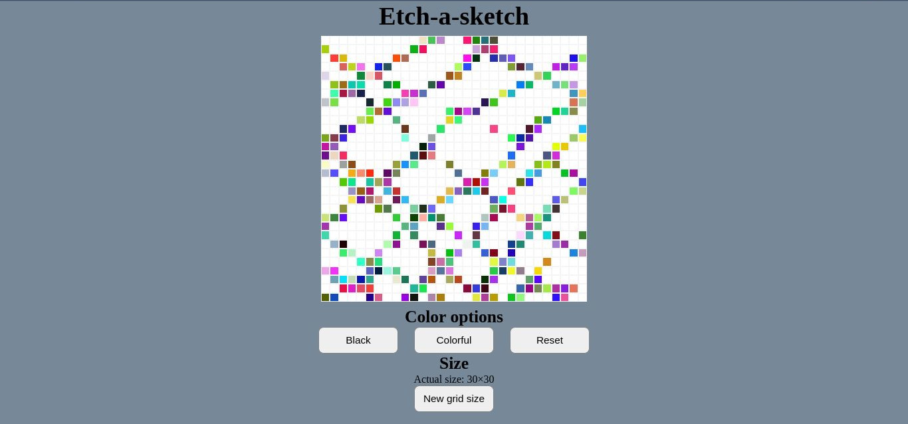

# Etch a sketch

Game project that allows the user to paint the squares anywhere when you hover the mouse in the blocks. 

The player can paint the squares in two different colors: black and rainbow (random colors). 

The game allows to change the grid size to any "n x n" size that the user wants.

The grid can be reset anytime with the reset button, thanks to this, the player can make unlimited pictures only limitated by the user's imagination.

## Screenshots

## Technologies used in this project

